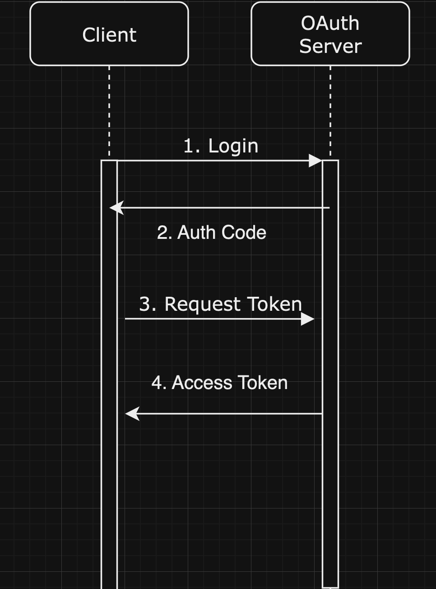

## Bomkey Module - OAtuth 2.0 Authorization Server

### Description
- Using this Module, you can use Authorization Server to Authenticate and Authorize the user.
- This Server provides AT(Access Token), RT(Refresh Token), scope, token_type, expires_in, etc.
- This Server is based on OAuth 2.0 Authorization Server.
> 해당 모듈은 사용자에 대한 인증, 권한 부여에 대한 인증서버 모듈입니다.  
> 해당 서버는 AT(Access Token), RT(Refresh Token), scope, token_type, expires_in 등을 제공합니다.  
> OAuth 2.0 Spec 을 기반하고 있으며, Spring-authorization-server 를 사용하여 구현되었습니다.
---

### Flow
1. Client sends a request to the Authorization Server.
2. Auth Server provides the Login Page.
3. User enters the credentials.
4. Auth Server validates the credentials.
5. Auth Server provides the Authorization Code.
6. Client sends the Authorization Code to the Auth Server.
7. Auth Server provides the Access Token and Refresh Token.

#### Client <-> Server Flow  

--- 
### Info
> https://docs.spring.io/spring-authorization-server/reference/getting-started.html  
> 해당 문서의 기반한 OAuth2.0 Authorization Server를 구현한 모듈입니다. 
> 기존의 설정에서 변경된 내역은 아래와 같습니다.  
>> 1. User 정보를 DB에서 가져오도록 변경.
>> 2. Client 정보(각 서버)를 DB에서 가져오도록 변경.
>> 3. RSA Key를 DB에서 가져오도록 변경.
>> 4. JWT 토큰에 Claim 추가로직.
>> 
> TEST 는 <a>Flow</a> 의 흐름과 test.http 파일을 참고하여 진행

---
#### ETC
http://localhost:9999/.well-known/openid-configuration
- 해당 URL 접속시, 해당 서버에서 제공하는 메타데이터를 제공함.(OpenID Connect)

http://localhost:9999/.well-known/oauth-authorization-server 
- OAuth2 서버에 초점이 맞춰져 있으며, 인증 정보보다는 토큰 발급 및 관리에 관련된 정보만 포함합니다.