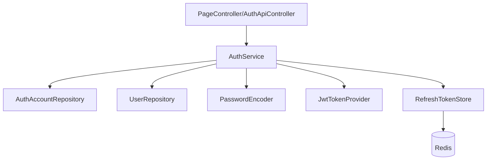
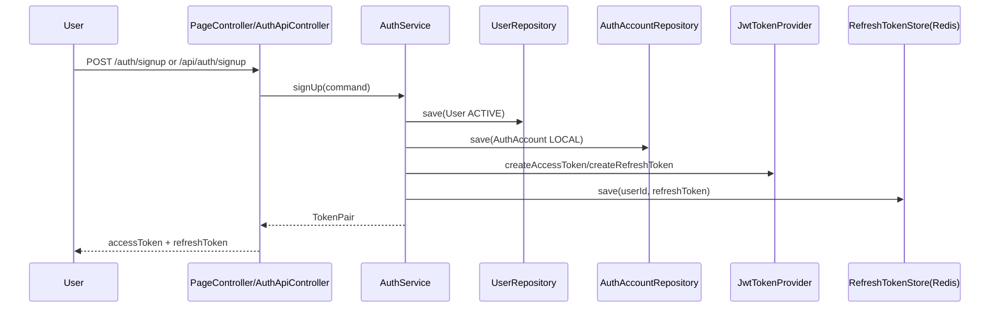
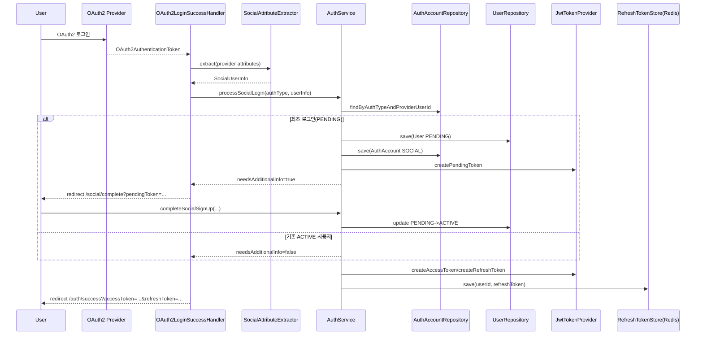
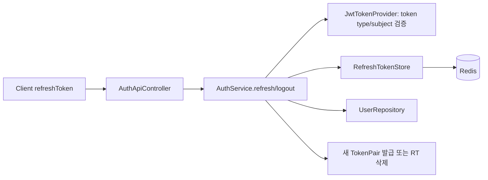

# social-sample

Spring Boot + Kotlin 기반의 로그인 샘플입니다.

## 구현 범위
- 일반 회원가입/로그인
- Kakao OAuth2 로그인
- Naver OAuth2 로그인
- 소셜 최초 로그인 시 `PENDING -> ACTIVE` 추가정보 입력 흐름
- 자체 JWT 인증
- Access Token 1시간, Refresh Token 7일
- Redis 기반 Refresh Token 저장/검증/삭제
- Thymeleaf 페이지 기반 흐름 확인
- Kotest 기반 단위 테스트

## 핵심 경로
- 메인: `/`
- 로그인: `/auth/login`
- 회원가입: `/auth/signup`
- 소셜 추가정보 입력: `/social/complete`
- 로그인 성공(토큰 확인): `/auth/success`
- 토큰 테스트 화면: `/auth/token-lab`

## API
- `POST /api/auth/signup`
- `POST /api/auth/login`
- `POST /api/auth/refresh`
- `POST /api/auth/logout`
- `POST /api/auth/social/complete`
- `GET /api/auth/me` (Bearer Access Token 필요)

토큰 정책:
- Access Token: 응답 헤더 `X-Access-Token`으로 전달, 전역 메모리에 저장(SessionStorage)
  - 현재는 SPA 가 아니라 세션스토리지 저장이지만, SPA 에서는 전역 상태관리 라이브러리로 관리하도록 전환
- Refresh Token: `HttpOnly` 쿠키(`refreshToken`)로 전달/사용 (HttpOnly secure)
- 토큰은 응답 body로 전달하지 않음

## 실행
1. Redis 실행 (`localhost:6379`)
2. OAuth 환경변수 설정
   - `KAKAO_CLIENT_ID`, `KAKAO_CLIENT_SECRET`
   - `NAVER_CLIENT_ID`, `NAVER_CLIENT_SECRET`
   - `JWT_SECRET`
3. 애플리케이션 실행
   - `./gradlew bootRun`

## 테스트
- `./gradlew test`

---

## 코드 흐름

### 로컬 회원가입/로그인

### 소셜 로그인 + 추가정보 입력

### 재발급/로그아웃

